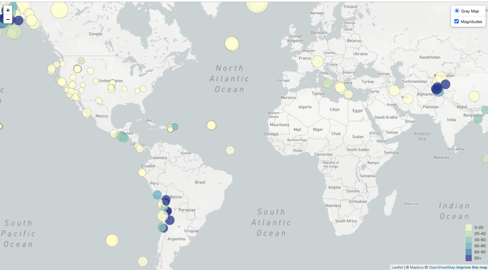

<h3>leaflet-challenge</h3>

For this assignment I completed the level one: basic visualization. Using data from <a href = "https://earthquake.usgs.gov/earthquakes/feed/v1.0/geojson.php">USGS GeoJSON Feed</a>, I selected the M 2.5+ Earthquakes from the past 7 days to visualize. I then created a basic gray map with circle markers, used the earthquake magnitude to determine the radius of the circle and earthquake depth to determine the color of the circle marker. To replicate my process you will need to add your mapbox API key to the <a href = "/leaflet-Step_1/static/js/configEDIT.js"> configEDIT.js</a> file I have included in the repo. 

